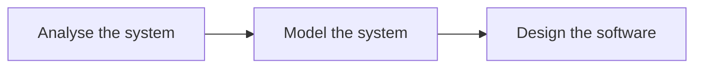

# Object Oriented Analysis/Design (OOA/OOD)

![[Pasted image 20230128211607.png]]

First describe the problem. Modelling and understanding.  -> specification -> solution space. 

### Analysis vs design
I analysefasen har vi fokus på å finne og beskrive objekter, eller konsepter, i problemdomenet.

I designfasen har vi fokus på å definere software objekter og hvordan de "collaborate to fulfill the requirements". 

Gruppeprosjektet handler KUN om analyse og design. 

> Det er dette det handler om! 

-Arne Wiklund

>[!example]-
> Hvordan fungerer et biblioteksystem? I et bibliotek må man se for seg de forskjellige konseptene og objektene. 
> - En bok har en tittel, forfatter osv.. 
> - Biblioteker har en addresse.
> - En forfatter kan ha flere bøker.
> - En lånetaker (patron) kan låne flere bøker, har en låneklasse osv. Er en klasse pga vi kan ha flere patron objekter.

Domain concept: book. (title). Visualization of domain concept. 

Alle klassetyper havner i en av 3 kategorier:

- **Entiteter** -> ender med å bli en databasetabeller
- **Controller** -> en klasse som skal ha kjernefunksjoner. Finnes minimum 1 controller i alle program. Denne klassen som DRIVER ting. 
- 

## OOA 
- Create a description of the domain from perspective of classification by objects. 
- Identify concepts, attributes and associations
- This can be expressed as a domain model or conceptual model. 

> [!example]- Example dice game
> A player picks up and rolls the dice. If the dice face value total seven, they win; otherwise, they loose. 
> - What concepts do we have here?
> 	- Player (score, wins)
> 	- Game (players, winner, losers)
> 	- Dice (value, amount)

### It involves:
- Discovering classes
- Describing relationship between the classes
- Describing the responsibilities of each class

### Tasklist
1. Obtain or prepare a textual description of the problem
2. Underline the nouns
3. Organize the nouns into groups to become candidate classes
4. Underline all the adjectives
5. Assign the adjectives as attributes of the candidate classes
6. Underline the verb, differentiate action from stative verb.
7. Assign the action verbs to operations of classes
8. Assign the stative verbs as attributes of classes or relationships.

### Conceptual data model
Nouns -> classes
Action verb (i.e. runs, does etc) -> operations
Adjectives -> attributes
Stative verbs (i.e. to be, is etc) -> relationships
Becomes a conceptual data model.

### Analyze nouns
- Redundant - two nouns for the same thing ? 
- Vague - what is meant by this noun ?
- Operational - does the noun actually represent somet